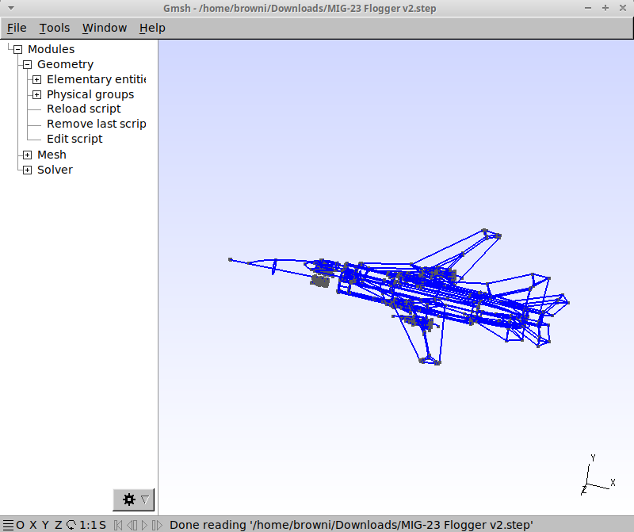

# Source of .step file
https://grabcad.com/

# Meshing Geometry with GMSH
Open the .step file with gmsh then follow the tutorial and export it as .msh file, you can use it for your OpenFOAM project.

# The tutorial
https://wiki.harvard.edu/confluence/download/attachments/233975963/01_Openfoam_freecad_tube_geometry_v2021.pdf?version=3&modificationDate=1648146376000&api=v2
https://wiki.harvard.edu/confluence/download/attachments/233975963/02_Openfoam_gmsh_hexahedral_meshing_v2021.pdf?version=3&modificationDate=1648146441000&api=v2
