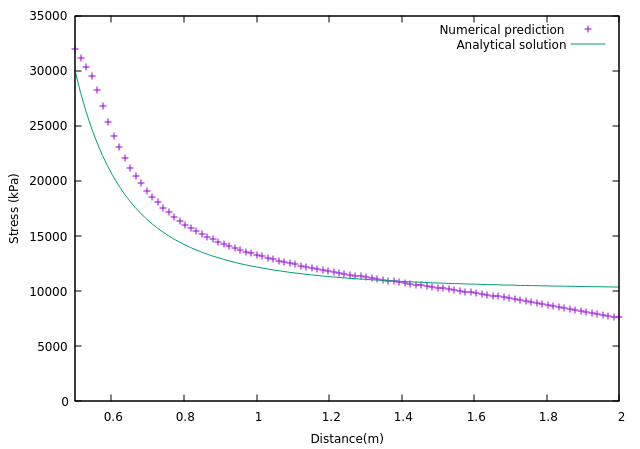

# About
This is the result of running the OpenFOAM tutorials either in video or picture for plot with Gnuplot or Paraview.

# Gnuplot
You need to install Gnuplot first, it can be used to plot the numerical solutions and the analytic solutions.
The computer that we use with OpenFOAM software will calculate numerical solutions after the solver is being run.

To plot StressAnalysis tutorial from OpenFOAM official user guide (https://cfd.direct/openfoam/user-guide/v9-plateHole/).

(Assuming you have run the solver or run the ./Allrun):

        cd $FOAM_RUN/stressAnalysis/solidDisplacementFoam/plateHole/postProcessing/graphUniform/100/
        gnuplot
        set xlabel "Distance (m)"
        set ylabel "Stress (kPa)"
        plot [0.5:2] [0:] "line_sigmaxx.xy" title "Numerical prediction",
        1e4*(1+(0.125/(x**2))+(0.09375/(x**4))) title "Analytical solution"

# Mathematics class to comprehend and understand more
1. Mathematical Methods (textbook: Elementary Differential Equations and Boundary Value Problems, Boyce DiPrima)
2. Mathematical Numerics (textbook: Numerical Analysis, Burden Faires)
3. Fundamentals of Physics (textbook: Fundamental of Physics, Halliday Resnick)
