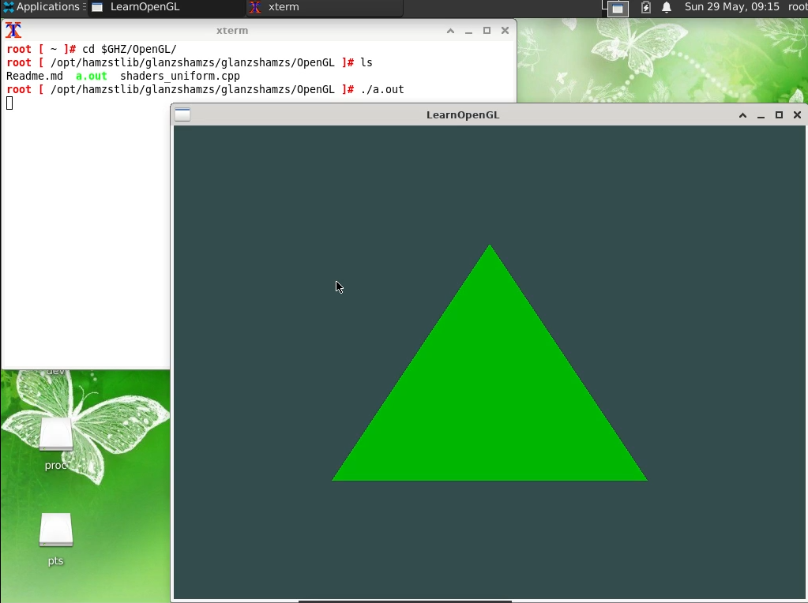

# About
Compilations of .cpp files to learn OpenGL and how we make graphics with computer and how your graphics card works.

# To build / compile the .cpp file
        g++ shaders_uniform.cpp -Ibuild/include /opt/hamzstlib/glanzshamzs/glanzshamzs/GLAD/build/src/glad.c -lglfw -ldl
        ./a.out

# About OpenGL
OpenGL is mainly considered an API (an Application Programming Interface) that provides us with a large set of functions that we can use to manipulate graphics and images. However, OpenGL by itself is not an API, but merely a specification, developed and maintained by the Khronos Group.

The OpenGL specification specifies exactly what the result/output of each function should be and how it should perform. It is then up to the developers implementing this specification to come up with a solution of how this function should operate.

The people developing the actual OpenGL libraries are usually the graphics card manufacturers. Each graphics card that you buy supports specific versions of OpenGL which are the versions of OpenGL developed specifically for that card (series).

#### Since most implementations are built by graphics card manufacturers, whenever there is a bug in the implementation this is usually solved by updating your video card drivers; those drivers include the newest versions of OpenGL that your card supports. This is one of the reasons why it's always advised to occasionally update your graphic drivers. 

# Getting to Know OpenGL More
1. The OpenGL libraries are written in C and allows for many derivations in other languages, but in its core it remains a C-library. Since many of C's language-constructs do not translate that well to other higher-level languages, OpenGL was developed with several abstractions in mind. One of those abstractions are objects in OpenGL. 
2. An object in OpenGL is a collection of options that represents a subset of OpenGL's state. For example, we could have an object that represents the settings of the drawing window; we could then set its size, how many colors it supports and so on. 
3. In OpenGL everything is in 3D space, but the screen or window is a 2D array of pixels so a large part of OpenGL's work is about transforming all 3D coordinates to 2D pixels that fit on your screen. The process of transforming 3D coordinates to 2D pixels is managed by the graphics pipeline of OpenGL. The graphics pipeline can be divided into two large parts: the first transforms your 3D coordinates into 2D coordinates and the second part transforms the 2D coordinates into actual colored pixels. 
4. To start drawing something we have to first give OpenGL some input vertex data. OpenGL is a 3D graphics library so all coordinates that we specify in OpenGL are in 3D (x, y and z coordinate). OpenGL doesn't simply transform all your 3D coordinates to 2D pixels on your screen; OpenGL only processes 3D coordinates when they're in a specific range between -1.0 and 1.0 on all 3 axes (x, y and z). 
5. The fragment shader is all about calculating the color output of your pixels. To keep things simple the fragment shader will always output an orange-ish color. 
6. The vertex shader allows us to specify any input we want in the form of vertex attributes and while this allows for great flexibility, it does mean we have to manually specify what part of our input data goes to which vertex attribute in the vertex shader. This means we have to specify how OpenGL should interpret the vertex data before rendering. 
7. In vertex buffer data, the position data is stored as 32-bit (4 byte) floating point values.
8. Shaders are little programs that rest on the GPU. These programs are run for each specific section of the graphics pipeline. In a basic sense, shaders are nothing more than programs transforming inputs to outputs. Shaders are also very isolated programs in that they're not allowed to communicate with each other; the only communication they have is via their inputs and outputs. 

#### 1 byte = 8-bit

#### We will be using GLFW for learning OpenGL
There are quite a few libraries out there that provide the functionality we seek, some specifically aimed at OpenGL. Those libraries save us all the operation-system specific work and give us a window and an OpenGL context to render in. Some of the more popular libraries are GLUT, SDL, SFML and GLFW. 

# GLFW
GLFW is a library, written in C, specifically targeted at OpenGL. GLFW gives us the bare necessities required for rendering goodies to the screen. It allows us to create an OpenGL context, define window parameters, and handle user input, which is plenty enough for our purposes. 

# GLAD
GLAD is an open source library that manages multi-Language GL/GLES/EGL/GLX/WGL Loader-Generator based on the official specs.

Since there are many different versions of OpenGL drivers, the location of most of its functions is not known at compile-time and needs to be queried at run-time. It is then the task of the developer to retrieve the location of the functions he/she needs and store them in function pointers for later use. 

That is why, we need GLAD to do the cumbersome tasks.

## Be sure to include GLAD before GLFW. 
    
    #include <glad/glad.h>
    #include <GLFW/glfw3.h>
    
# Source
https://learnopengl.com/Getting-started/OpenGL

https://learnopengl.com/Getting-started/Shaders
